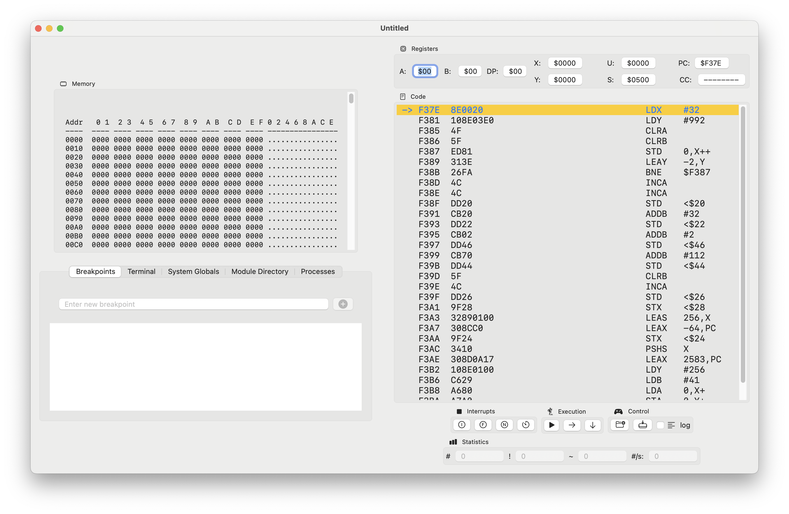

# Hyper9
Hyper9 is a simulator written in Swift. It emulates the [Turbo9 microprocessor](http://www.turbo9.org/).

## Memory I/O Map

### $0000-$FEFF: RAM

### $FF00: Terminal Output Register
* Write: sends character to terminal
* Read: reads last character sent

### $FF01: Terminal Input Register
* Write: N/A
* Read: reads last character from terminal
    
### $FF02: IRQ Status Register
* Bit 0: Timer asserted IRQ (Write 1 to that bit to clear IRQ)
* Bit 1: Terminal input asserted IRQ (Write 1 to that bit to clear IRQ)

### $FF03: IRQ Control Register
* Bit 0: 1=Timer IRQ enabled; 0=Timer IRQ disabled
* Bit 1: 1=Temrinal input IRQ enabled; 0=Termianl input IRQ disabled

